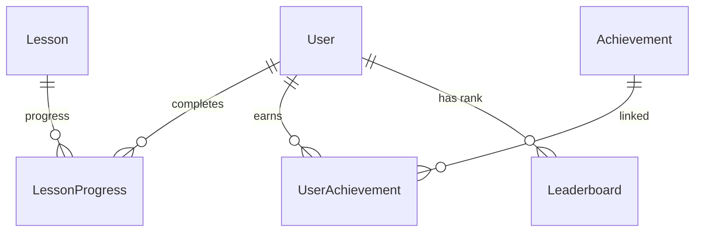
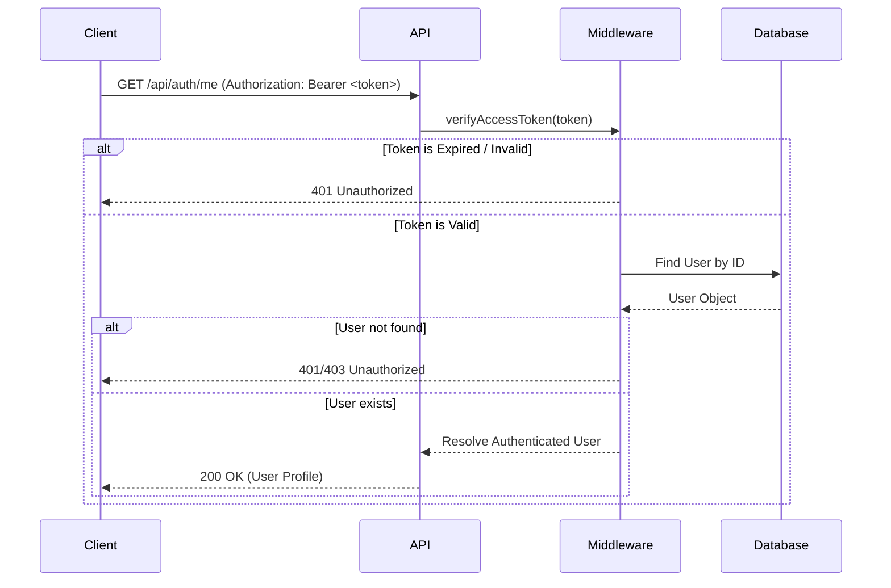

# Cerevia

Cerevia is a modern gamified learning platform built using the latest web technologies. The platform engages and rewards users through daily streaks, lesson progress, XP accumulation, achievements, and weekly competitive leaderboards.

Cerevia is designed with high-performance scaling in mind, decoupling expensive read operations (like leaderboards) from write latencies (like lesson completions) using state-of-the-art caching patterns.

---

## 🎯 Vision

Cerevia's mission is to make learning addictive, rewarding, and highly interactive. By combining modern game design mechanics (streaks, leaderboards, and instant XP feedback) with premium software architecture, Cerevia aims to become a leading gamified educational platform worldwide.

---

## 🛠️ Technology Stack

- **Framework**: Next.js 15 (App Router)
- **Language**: TypeScript
- **Styling**: Tailwind CSS v4
- **ORM**: Prisma
- **Database**: PostgreSQL (Prisma Adapter)
- **Linter**: ESLint 9
- **Formatter**: Prettier

---

## 📂 Folder Structure

The repository follows a clean, modular, and scalable project layout inside the `src/` directory to separate concerns:

```text
cerevia/
│
├── prisma/                    # Prisma Database Schema and Migrations
│   └── schema.prisma          # Database schema models
│
├── src/
│   ├── app/                   # Next.js App Router (Layouts, Pages, and Global CSS)
│   │   ├── globals.css        # Global CSS styles
│   │   ├── layout.tsx         # Main entry point layout
│   │   └── page.tsx           # Home / Dashboard landing page
│   │
│   ├── components/            # Reusable UI Components
│   │   └── ui/                # Base design system components (buttons, input, dialogs)
│   │
│   ├── hooks/                 # Custom React Hooks
│   │
│   ├── lib/                   # Third-party configuration and clients (Prisma, Redis)
│   │   └── streak-manager.ts  # Core business logic for streaks and leaderboards
│   │
│   ├── styles/                # Global style sheets, design tokens, and utilities
│   │
│   ├── types/                 # Shared TypeScript interfaces and type definitions
│   │
│   └── utils/                 # General utility and helper functions
│
├── docs/                      # Technical specification, architectural decisions, and diagrams
├── public/                    # Static assets (images, icons, vectors)
│
├── .env.example               # Documentation of required environment configurations
├── eslint.config.js           # ESLint rules and flat config settings
├── next.config.ts             # Next.js compiler and build optimization settings
├── package.json               # Project manifest, scripts, and package dependencies
├── prettier.config.js         # Prettier formatting style guide
└── tsconfig.json              # TypeScript compilation rules
```

---

## 🚀 Getting Started

### Prerequisites

Ensure you have the following installed:
- **Node.js** (v20+ recommended) and **npm** (v10+)
- **Docker** and **Docker Compose** (for containerized setup)

---

### Option A: Containerized Setup (Recommended)

This setup spins up Next.js (with hot reload enabled), PostgreSQL, and Redis in isolated containers.

1. **Clone the Repository**
   ```bash
   git clone https://github.com/kalviumcommunity/S116-0726-StackForge-FullStack-Nextjs-PostgreSQL-Prisma-Cerevia.git
   cd S116-0726-StackForge-FullStack-Nextjs-PostgreSQL-Prisma-Cerevia
   ```

2. **Configure Environment Variables**
   Create a `.env` file from the template:
   ```bash
   cp .env.example .env
   ```

3. **Start Containers**
   Build and start the application stack:
   ```bash
   docker compose up --build
   ```
   *This starts the database, cache, and Next.js services. Next.js binds to your local files using Docker volumes, so **hot-reloading** works automatically when you modify files.*

4. **Stop Containers**
   To stop the services:
   ```bash
   docker compose down
   ```
   To stop and remove database volumes (resets database data):
   ```bash
   docker compose down -v
   ```

5. **Rebuilding Containers**
   If you change dependencies in `package.json` or config files, run a clean rebuild:
   ```bash
   docker compose build --no-cache
   docker compose up
   ```

---

### Option B: Local Setup (Without Docker)

1. **Clone the Repository**
   ```bash
   git clone https://github.com/kalviumcommunity/S116-0726-StackForge-FullStack-Nextjs-PostgreSQL-Prisma-Cerevia.git
   cd S116-0726-StackForge-FullStack-Nextjs-PostgreSQL-Prisma-Cerevia
   ```

2. **Install Dependencies**
   ```bash
   npm install --legacy-peer-deps
   ```

3. **Set Up Environment Variables**
   Copy the environment variables template and configure it:
   ```bash
   cp .env.example .env.local
   ```
   *Note: Set your database connections, Redis URLs, and authentication secrets in `.env.local`. Remember to target `localhost` instead of the Docker service hostname `db` / `redis`.*

4. **Generate Prisma Client**
   Run the Prisma generator to output client typings:
   ```bash
   npx prisma generate
   ```

---

### 🔍 Docker Troubleshooting

*   **Port Conflicts**: If ports `3000`, `5432`, or `6379` are already in use on your machine, stop any local PostgreSQL/Redis servers, or adjust the `DB_PORT`/`REDIS_PORT` mappings in `.env`.
*   **Database Hostname**: Containers use Docker bridge DNS to resolve services. Do not use `localhost` for database connections inside Docker; refer to `db` instead (e.g. `postgresql://postgres:postgrespassword@db:5432/cerevia`).
*   **Prisma Client Out-of-Sync**: If you change the Prisma schema, run `npx prisma generate` inside the container or rebuild the web container to sync client types.

---

## 🗄️ Database Architecture & Setup

Cerevia uses **PostgreSQL** as its primary relational database and **Prisma ORM** for data modeling and type safety.

### 1. Database Schema Models

*   **User**: Handles profiles, logins (`password` hashes), current and maximum streaks, total XP (`totalXP`), and activity tracking.
*   **Lesson**: Holds course titles, difficulty tiers (`Beginner`, `Intermediate`, `Advanced`), and XP rewards (`xpReward`).
*   **LessonProgress**: Records completions connecting a `User` to a completed `Lesson`.
*   **Achievement & UserAchievement**: Supports a reusable badge system allowing users to unlock milestone achievements with timestamped unlock dates.
*   **Leaderboard**: Stores weekly leaderboard caches tracking user points and ranks for any given week of a year.

### 2. Schema Relations



### 3. Migrations & Seeding

*   **Create/Apply Migrations**: Sync your schema changes to the local PostgreSQL database:
    ```bash
    npx prisma migrate dev
    ```
*   **Seed static data**: Populate the database with default lessons required for development:
    ```bash
    npx prisma db seed
    ```

---

## 🔐 Authentication & Security

Cerevia implements a production-grade, secure JWT-based authentication system.

### 1. Security Standards
*   **Password Hashing**: Passwords are never stored in plain-text. They are hashed using `bcryptjs` with a work factor of `10`.
*   **Input Validation**: Authentication payloads are strictly validated on the server using `Zod` schemas. Improperly formatted emails or short passwords are rejected immediately.
*   **JSON Web Tokens (JWT)**: Access tokens are signed using the HS256 algorithm with a secret defined in the environment.
*   **Zero-Password Leakage**: Password hashes are explicitly excluded from database selectors and REST API payloads.

### 2. API Endpoints
*   **`POST /api/auth/register`**: Registers a new user. Checks for duplicates, hashes the password, and returns the profile without the password hash.
*   **`POST /api/auth/login`**: Validates credentials and returns a signed JWT along with user details.
*   **`GET /api/auth/me`**: A protected endpoint that decodes the `Authorization: Bearer <token>` header to return the user's details.

### 3. Authorization Flow



---

## 💻 Development Commands

The following scripts are available in `package.json`:

| Script | Command | Purpose |
|--------|---------|---------|
| `npm run dev` | `next dev` | Start the development server on `http://localhost:3000` |
| `npm run build` | `next build` | Build a production-optimized bundle of the app |
| `npm run start` | `next start` | Run the built production application server |
| `npm run lint` | `next lint` | Run ESLint checks to identify formatting and static code issues |
| `npm run format` | `prettier --write` | Run Prettier to automatically format code across the repository |

---

## 🛡️ Engineering Standards

- **Zero-Warning Codebase**: All TypeScript type checks, ESLint linting, and Next.js builds must complete with zero errors or warnings.
- **Modern ES Modules**: Enforces modern ES module syntax (`import`/`export`) globally using `"type": "module"`.
- **Absolute Imports**: Source folders should import elements using `@/*` path aliases (e.g. `@/components`, `@/lib`, `@/hooks`).
- **Dry & Clean**: No commented-out code blocks or placeholders in the production branch.
