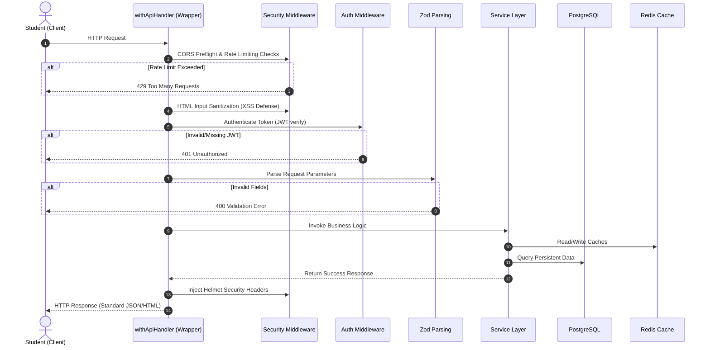
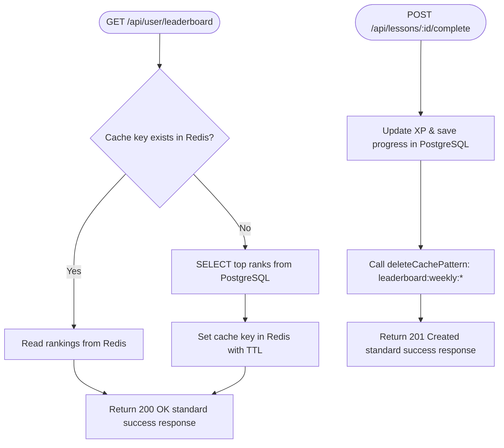

<div align="center">

<br/><br/>

<h1>Cerevia</h1>

<p><strong>A scalable, production-grade gamification system for BYJU'S — powering daily learning streaks and weekly competitive leaderboards at scale.</strong></p>

<br/>


<br/><br/>

</div>

---

## Table of Contents

- [Problem Statement](#problem-statement)
- [Solution Design](#solution-design)
- [System Architecture & Request Flows](#system-architecture--request-flows)
- [Tech Stack](#tech-stack)
- [Project Structure](#project-structure)
- [Key Design Decisions](#key-design-decisions)
- [Interactive OpenAPI / Swagger Docs](#interactive-openapi--swagger-docs)
- [Environment Configuration](#environment-configuration)
- [Docker & Database Setup](#docker--database-setup)
- [Running Locally & Build Commands](#running-locally--build-commands)
- [Testing & Quality Assurance](#testing--quality-assurance)
- [API Reference](#api-reference)
- [Security Hardening & API Protection](#security-hardening--api-protection)
- [Contribution Guide](#contribution-guide)
- [Contributors](#contributors)

---

## Problem Statement

BYJU'S needs a robust gamification layer to improve student engagement and retention across its learning platform. Two core features must be implemented:

**Daily Streaks**

A streak represents the number of consecutive days a student has completed at least one lesson. It must increment instantly when a lesson is completed, and reset automatically if more than 24 hours pass without any activity. The system must handle concurrent lesson completions without double-counting and must be accurate under high load.

**Weekly Leaderboard**

Every lesson completion updates the student's weekly score in real time. However, computing and serving a fully ranked leaderboard on every request is expensive at BYJU'S scale. The public-facing leaderboard must therefore be cached and recalculated on a fixed hourly schedule — trading slight staleness for significantly reduced database load.

---

## Solution Design

The core insight driving the architecture is the separation of **write latency** from **read latency**:

- **Writes** (lesson completions) must be instant — streak updates and score increments happen synchronously on the lesson completion event, with no perceptible delay for the student.
- **Reads** (leaderboard display) can tolerate a one-hour cache window — Redis holds the pre-computed leaderboard snapshot and a scheduled job refreshes it hourly from PostgreSQL.

This decoupling means the leaderboard page never touches the database directly, and the database is never under read pressure from leaderboard queries.

---

## System Architecture & Request Flows

### 1. High-Level Architecture


### 2. Request Flow Sequence
Every inbound API request to Cerevia follows a standardized sequence managed by the `withApiHandler` route wrapper:



### 3. Redis Caching Flow
To ensure high read throughput, weekly leaderboard results are cached using a cache-aside invalidation pattern:



---

## Tech Stack

| Layer | Technology | Purpose |
|---|---|---|
| Framework | Next.js 15 (App Router) | Full-stack - API routes and React frontend in one repo |
| Language | TypeScript | Type-safe code across frontend and backend |
| Database | PostgreSQL | Persistent storage for streaks, scores, users |
| ORM | Prisma | Type-safe database queries, migrations, schema management |
| Cache | Redis | Hourly leaderboard snapshot, cache-aside pattern |
| Auth | Custom JWT (HS256) | Security middleware and authenticated sessions |
| Validation | Zod | Parameter, query, and request body schema enforcement |
| Task Scheduling | Node-Cron | Hourly leaderboard caching and daily streak resets |
| Styling | Tailwind CSS | Utility-first UI styling |

---

## Project Structure

```
cerevia/
|
+-- prisma/
|   +-- schema.prisma            # User, Streak, WeeklyScore, XpRecord models
|   +-- migrations/              # Prisma migration history
|   +-- seed.ts                  # Database seeding script
|
+-- src/
|   +-- app/
|   |   +-- api/
|   |   |   +-- auth/
|   |   |   |   +-- login/       # POST /api/auth/login
|   |   |   |   +-- register/    # POST /api/auth/register
|   |   |   |   +-- me/          # GET /api/auth/me
|   |   |   +-- docs/            # Interactive Swagger UI (GET /api/docs)
|   |   |   +-- lessons/
|   |   |   |   +-- [id]/
|   |   |   |   |   +-- complete/# POST /api/lessons/[id]/complete
|   |   |   |   |   +-- route.ts # GET /api/lessons/[id]
|   |   |   |   +-- progress/    # GET /api/lessons/progress
|   |   |   |   +-- route.ts     # GET /api/lessons (list with query params)
|   |   |   +-- streak/          # GET /api/streak
|   |   |   +-- user/
|   |   |       +-- profile/     # GET/PUT /api/user/profile
|   |   |       +-- streak/      # GET /api/user/streak (alias)
|   |   |       +-- xp/          # GET /api/user/xp
|   |   |       +-- leaderboard/ # GET /api/user/leaderboard & /rank
|   |
|   +-- lib/
|   |   +-- api-response.ts      # standard responses and higher order wrapper
|   |   +-- errors.ts            # Custom domain Error subclasses
|   |   +-- jwt.ts               # Token sign and verify operations
|   |   +-- logger.ts            # Secure log redaction wrapper
|   |   +-- prisma.ts            # Prisma client singleton
|   |   +-- redis.ts             # Redis client helpers & fail-safes
|   |   +-- security.ts          # Helmet, CORS, Rate limits, HTML sanitization
|   |   +-- services/            # Business Logic / Service Layer
|   |   |   +-- gamification.ts  # Level progression & XP math
|   |   |   +-- leaderboard.ts   # Leaderboard rankings queries
|   |   |   +-- lessons.ts       # Lessons database queries
|   |   |   +-- profile.ts       # Profile reads/writes
|   |   |   +-- progress.ts      # Lesson completion logs
|   |   |   +-- streak.ts        # Streak calculations and verification
|   |   +-- validation/          # Zod validation schemas
|   |
|   +-- utils/
|       +-- date.ts              # ISO Week/Year calculation helper
|
+-- tests/
|   +-- run-all.ts               # Automated sequental test runner
|   +-- [name].test.ts           # Individual integration tests
|
+-- package.json
+-- README.md
+-- CONTRIBUTING.md
```

---

## Key Design Decisions

**Why Redis for the leaderboard and not PostgreSQL directly?**
At BYJU'S scale, thousands of students may view the leaderboard simultaneously. Running a `SELECT ... ORDER BY score DESC` on PostgreSQL for every request would create read pressure that spikes exactly when the platform is most active. Redis serves the pre-computed snapshot in under 1ms regardless of concurrent readers.

**Why invalidate Redis on score update rather than waiting for the cron?**
When a student completes a lesson, the cache is invalidated so the next leaderboard request triggers a fresh read from PostgreSQL. This prevents a student from completing a lesson and seeing a stale leaderboard for up to an hour. The cron job is a safety net that ensures the cache is always refreshed even when no lessons are being completed.

**Why streak logic runs synchronously on lesson completion?**
Streak accuracy is a trust signal for the student. Deferring it to a background job risks the streak showing as unchanged immediately after a lesson, breaking the instant feedback loop that makes gamification effective.

**How does the 24-hour reset work without a cron job?**
Rather than a scheduled task that scans all users, the streak is evaluated lazily on each lesson completion. The service reads `last_activity_at` from the database and compares it to `now()`. If the gap exceeds 24 hours, the streak resets to 1. This scales to millions of users with zero background processing cost.

---

## Interactive OpenAPI / Swagger Docs

Cerevia includes a built-in, interactive Swagger UI to easily view, explore, and test API endpoints.

- **Interactive UI URL**: `http://localhost:3000/api/docs`
- **OpenAPI 3.0 Specification JSON**: `http://localhost:3000/api/docs/swagger.json`

The documentation UI is hosted locally and fetches its schema from `/api/docs/swagger.json`. It provides input fields to authenticate using JWT tokens (Bearer auth) and perform direct API invocations.

---

## Environment Configuration

Copy the template `.env.example` into a local configuration file named `.env` and adjust the variables:

| Environment Variable | Description | Default Value | Purpose / Action |
|---|---|---|---|
| `PORT` | Local server port | `3000` | Port on which the Next.js server listens. |
| `NEXT_PUBLIC_APP_URL` | Base application URL | `http://localhost:3000` | Used for dynamic links and callback resolution. |
| `DB_USER` | Database username | `postgres` | Username credential for the PostgreSQL server. |
| `DB_PASSWORD` | Database password | `postgrespassword` | Password credential for the PostgreSQL server. |
| `DB_NAME` | Database schema name | `cerevia` | Target schema database name. |
| `DB_PORT` | Database port number | `5432` | TCP port the PostgreSQL server listens on. |
| `REDIS_PORT` | Cache port number | `6379` | TCP port the Redis server listens on. |
| `DATABASE_URL` | Prisma DB connection URL | `postgresql://...` | Full connection URI utilized by Prisma Client for reads/writes. |
| `REDIS_URL` | Cache connection URL | `redis://...` | Full connection URI utilized by `ioredis` to manage the cache layer. |
| `JWT_SECRET` | Auth Token Secret | *None (Required)* | High-entropy secret used for JWT signing. Must be 32+ characters in production. |
| `ALLOWED_ORIGINS` | CORS Permitted Origins | `http://localhost:3000` | Comma-separated list of origins permitted to issue CORS requests. |
| `LEADERBOARD_CACHE_TTL` | Redis cache TTL | `3600` | Cache expiry in seconds for weekly rankings data in Redis. |
| `LEADERBOARD_REFRESH_CRON` | Cache precalc schedule | `0 * * * *` | Cron expression scheduling the hourly cache generation job. |
| `STREAK_VERIFICATION_CRON` | Streak verification schedule| `0 0 * * *` | Cron expression scheduling the daily streak verification job. |

---

## Docker & Database Setup

### 1. Spinning Up Infrastructure (Docker)
Ensure Docker Desktop is running locally. Use Docker Compose to launch isolated database (PostgreSQL) and caching (Redis) services in the background:

```bash
# Start Postgres and Redis services in detached mode
docker compose up -d db redis

# Check that containers are running and healthy
docker ps
```

### 2. Database Sync & Seeding
Deploy migrations to update the database schema structure and seed initial values (lessons metadata):

```bash
# Apply migrations and create/synchronize PostgreSQL schema
npx prisma db push

# Seed initial lesson contents
npx prisma db seed
```

---

## Running Locally & Build Commands

Manage Cerevia locally using standard npm commands:

```bash
# 1. Install dependencies
npm install

# 2. Run the development server
npm run dev

# 3. Build the application for production deployment
npm run build

# 4. Start the built production server locally
npm run start

# 5. Automatically format code with Prettier and Prisma Format
npm run format
```

---

## Testing & Quality Assurance

Cerevia features a production-grade backend testing suite designed to verify the correctness, performance, and security of the entire application. All tests are automated, run deterministically in isolated child processes, and compile under strict TypeScript type checks with zero lints or warnings.

### 1. Test Architecture & Structure

All tests are placed in the `tests/` directory:

| Test Suite | Focus & Scenarios Verified |
|---|---|
| `auth.test.ts` | User registration, password hashing, conflict errors, login, credentials verification, JWT signature validity, token tampering, and route authorization checks. |
| `lessons.test.ts` | Retrieve all lessons, search filters (case-insensitivity), order filters, pagination structures, fetch by ID, and nonexistent UUID parameters. |
| `progress.test.ts` | Initial state verification, complete lesson events, duplicate completion protection, and invalid user or lesson UUID checks. |
| `streak.test.ts` | Consecutive activity day increments, 24h/48h lazy streak resets, daily activity timestamp updates, and edge-case multi-day completions. |
| `xp.test.ts` | XP rewards computation, duplicate completion check, level boundaries calculation (using `XP = 100 * (level - 1) + 10 * (level - 1)^2`), and level progression transitions. |
| `leaderboard-service.test.ts` | Dynamic ranking calculations, page limit & offsets (pagination), score tie-breakers, and user-specific ranking lookups. |
| `leaderboard-validation.test.ts` | Query parameters schema checks, out-of-bounds page sizes, out-of-bounds week/year integers, and default parameter fallbacks. |
| `redis-cache.test.ts` | Redis connection handling, get/set cache functions, pattern-based cache purging (`deleteCachePattern`), and connection failure fail-safes. |
| `security.test.ts` | Helmet headers injection, CORS policy validations, sliding-window rate limiters, request HTML/XSS sanitization, and secure log credential redaction. |
| `error-handler.test.ts` | Centralized exception mapping, validation errors to JSON schema, database connection failure hiding, and standard API response envelopes. |
| `cron.test.ts` | Hourly leaderboard caching task, daily streak verification/reset, logging, and connection-loss tolerance. |
| `profile.test.ts` | Profile retrieval, field updates, avatar URL validation, bio length constraints, and schema checks. |

### 2. Running the Tests

A unified test runner at `tests/run-all.ts` manages the sequential execution of all suites. Each test runs in a fully isolated child process to prevent connection sharing, memory leaks, or race conditions.

To execute the test suite, ensure your database and Redis services are running, then execute:

```bash
# Run the entire test suite
npm run test
```

### 3. Verification & Code Quality

Our quality assurance pipeline guarantees code correctness and compliance:

```bash
# Run TypeScript compilation checks
npx tsc --noEmit

# Run ESLint validation checks
npm run lint
```

---

## API Reference

Every endpoint in Cerevia returns a standardized response envelope. Success payloads yield status 200/201 alongside `{ success: true, message: string, data: T }`. Failures yield status 4xx/5xx alongside `{ success: false, message: string, errorCode: string, details: [...] }`.

### Authentication Required (HTTP Header format)
Endpoints marked with "Auth: Yes" require the following header:
```
Authorization: Bearer <JWT_TOKEN>
```

---

| Method | Endpoint | Auth | Description |
|---|---|---|---|
| `POST` | `/api/auth/register` | No | Creates a new user profile. |
| `POST` | `/api/auth/login` | No | Validates credentials and returns JWT. |
| `GET` | `/api/auth/me` | Yes | Retrieves profile info of current token holder. |
| `GET` | `/api/lessons` | Yes | Paginated fetch with query parameter filters. |
| `GET` | `/api/lessons/[id]` | Yes | Fetches metadata for a single lesson. |
| `POST` | `/api/lessons/[id]/complete` | Yes | Records lesson completion, triggers streak checks, and issues XP. |
| `GET` | `/api/lessons/progress` | Yes | Returns completed vs remaining lesson lists. |
| `GET` | `/api/streak` | Yes | Fetches user's current and longest streak scores. |
| `GET` | `/api/user/streak` | Yes | Fetch-all alias returning user's streak statistics. |
| `GET` | `/api/user/profile` | Yes | Retrieves bio, email, avatar, and basic user data. |
| `PUT` | `/api/user/profile` | Yes | Updates profile details (fullName, bio, avatar). |
| `GET` | `/api/user/xp` | Yes | Fetches level progression progress and historical XP logs. |
| `GET` | `/api/user/leaderboard` | Yes | Fetches weekly XP leaderboard ranks (Cache-backed). |
| `GET` | `/api/user/leaderboard/rank` | Yes | Fetches authenticated user's relative ranking and score. |

---

## Security Hardening & API Protection

Cerevia employs production-grade security practices aligned with OWASP Top 10 guidelines to defend against common attack vectors:

### 1. HTTP Security Headers (Helmet)
We dynamically inject security headers dynamically generated via **Helmet** to protect clients and obscure server details:
- **Content-Security-Policy (CSP)**: Disallows unauthorized styles/scripts; restricts font/image origins.
- **X-Frame-Options**: Set to `SAMEORIGIN` to prevent clickjacking attacks.
- **X-Content-Type-Options**: Set to `nosniff` to prevent MIME-sniffing.
- **Referrer-Policy**: Set to `no-referrer` to prevent referrer information leaks.
- **Strict-Transport-Security (HSTS)**: Enforces TLS encryption for 180 days.
- **X-Download-Options / X-Permitted-Cross-Domain-Policies**: Protects legacy browsers against cross-domain content execution.

### 2. Cross-Origin Resource Sharing (CORS)
- CORS policies match against the comma-separated `ALLOWED_ORIGINS` environment variable. Preflight `OPTIONS` requests are handled by responding with status `204 No Content`.

### 3. API Rate Limiting
- **Sliding-Window Limiter**: Tracks client requests per IP per route within a sliding time window. Falls back to in-memory cache if Redis is offline.
- **Endpoint Policies**:
  - Auth routes (`/api/auth/login`, `/api/auth/register`): **5 requests per 60 seconds** to mitigate brute-force attacks.
  - General routes: **60 requests per 60 seconds**.

### 4. Input Sanitization
- **XSS Mitigation**: An XSS string sanitizer recursively scans incoming JSON bodies (`POST`, `PUT`, `PATCH`) and escapes HTML special characters.

### 5. Authentication Security (JWT Hardening)
- Access token validation explicitly requires the `HS256` signature algorithm. The application throws a runtime startup exception if `JWT_SECRET` is missing.

### 6. Secure Logger
- A custom logger wrapper intercepts all system outputs (`console.log`, `console.error`) and uses regex patterns to redact passwords, bearer auth tokens, and JSON Web Tokens.

---

## Contribution Guide

To contribute to Cerevia, please read our [CONTRIBUTING.md](file:///c:/Users/hardi/S116-0726-StackForge-FullStack-Nextjs-PostgreSQL-Prisma-Cerevia/CONTRIBUTING.md) guide.

It details:
- **Branch Naming**: Prefix naming rules (`feat/`, `fix/`, `docs/`, `refactor/`, `chore/`).
- **Commit Messages**: Formatting standard (`type(scope): description`) using Conventional Commits.
- **Pull Requests**: Verification checks list to perform before raising code reviews.
- **Coding Standards**: Lint, format, and wrapper usage rules.

---

## Contributors

Squad 116 · Team 03

| Name | GitHub |
|---|---|
| Avadhut Pawar | [@Avadhut-Pawar31](https://github.com/Avadhut-Pawar31) |
| Areesh Ahmed | [@areesh-ahmed](https://github.com/areesh-ahmed) |
| Hardik Kaurani | [@hardikkaurani](https://github.com/hardikkaurani) |

---

<div align="center">

*Cerevia — Squad 116, Team 03*

</div>
